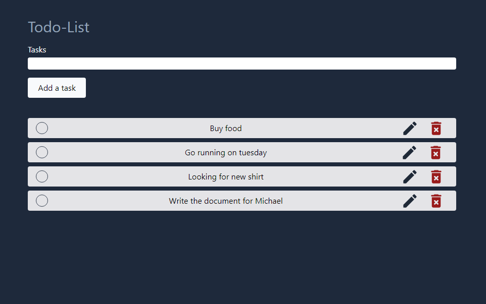

# Todolist App


<!-- TABLE OF CONTENTS -->
<details>
  <summary>Table of Contents</summary>
  <ol>
    <li>
      <a href="#about-project">About Project</a>
      <ul>
        <li><a href="#built-with">Built With</a></li>
        <li><a href="#functionalities">Functionalities</a></li>
      </ul>
    </li>
    <li>
      <a href="#getting-started">Getting Started</a>
      <ul>
        <li><a href="#prerequisites">Prerequisites</a></li>
        <li><a href="#installation">Installation</a></li>
      </ul>
    </li>
    <li><a href="#usage">Usage</a></li>
  </ol>
</details>

## About Project



Simple To-do list app, to order your tasks.
Using PostgreSQL as database, Golang for back-end part, and ReactJS/Javascript for front-end. Using also NginX as web and static file server, and as reverse proxy. Each services are containerized with Docker and run with Docker Compose.

### Built with

#### Server :
* [![Golang][Go]][Go-url]
* [![Nginx][Nginx]][Nginx-url]
#### Client:
* [![React][React.js]][React-url]
* [![Vite][Vite]][Vite-url]
* [![Tailwind CSS][Tailwind]][Tailwind-url]
#### Database :
* [![Postgre][Postgre]][Postgre-url]
#### Containerization :
* [![Docker][Docker]][Docker-url]

### Functionalities

* Real time tasks list.
* Add new task, settings his content.
* Delete task, by clicking on red button to the right of each tasks.
* Edit task, by clicking on the pencil button to the right of each tasks.
* Check/uncheck task with checkbox button. This will validate and cross task.

## Getting Started

### Prerequisites

You need to have Docker and Docker Compose installed on your computer to run project services. This can be done here : https://docs.docker.com/get-docker/

### Installation

1. If not already done, get a public SSH key.

2. Clone the repo via SSH
  ```sh
  git clone git@github.com:Thybaau/todolist-app.git
  ```

3. Or you can clone it via HTTPS
  ```sh
  git clone https://github.com/Thybaau/todolist-app.git
  ```

## Usage

In project root, do the following command :

```shell
docker compose up -d
```

Remove the `-d` if you want to see the logs in your terminal. App should now correctly running.

Connect to Nginx server by using `localhost` or `localhost:80` address.

The project is composed of three services : `database`, `server` and `nginx`. If you want to see the logs of a specifical service in realtime, write this command and replace `<service_name>` with one of the three services names :

```shell
docker compose logs -f <service_name>
```

If you want to enter in one of the containers :

```shell
docker compose exec -it <service_name> sh
```

<!-- MARKDOWN LINKS & IMAGES -->

[issues-shield]: https://img.shields.io/github/issues/github_username/repo_name.svg?style=for-the-badge
[issues-url]: https://github.com/github_username/repo_name/issues

[linkedin-shield]: https://img.shields.io/badge/-LinkedIn-black.svg?style=for-the-badge&logo=linkedin&colorB=555
[linkedin-url]: https://linkedin.com/in/linkedin_username

[Go]:     https://img.shields.io/badge/Go-00ADD8?style=for-the-badge&logo=go&logoColor=white
[Go-url]: https://go.dev/

[React.js]: https://img.shields.io/badge/React-20232A?style=for-the-badge&logo=react&logoColor=61DAFB
[React-url]: https://reactjs.org/

[Vite]: https://img.shields.io/badge/Vite-B73BFE?style=for-the-badge&logo=vite&logoColor=FFD62E
[Vite-url]: https://vitejs.dev/

[Tailwind]: https://img.shields.io/badge/Tailwind_CSS-38B2AC?style=for-the-badge&logo=tailwind-css&logoColor=white
[Tailwind-url]: https://tailwindcss.com/

[Docker]: https://img.shields.io/badge/Docker-2CA5E0?style=for-the-badge&logo=docker&logoColor=white
[Docker-url]: https://www.docker.com/

[Nginx]: https://img.shields.io/badge/Nginx-009639?style=for-the-badge&logo=nginx&logoColor=white
[Nginx-url]: https://www.nginx.com/

[Postgre]: https://img.shields.io/badge/PostgreSQL-316192?style=for-the-badge&logo=postgresql&logoColor=white
[Postgre-url]: https://www.postgresql.org/
